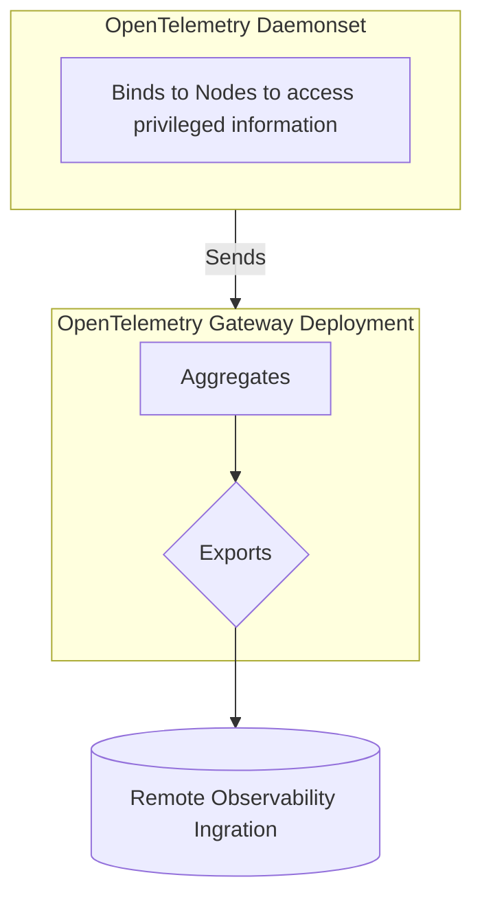

# ob-team-opentelemetry-poc
A proof-of-concept by the Observability and Backup team for using OpenTelemetry. The proof-of-concept is primarily aimed at replacing current logging infrastructure.

## POC Setup


Setup OpenSearch
```sh
helm repo add opensearch https://opensearch-project.github.io/helm-charts/
helm install opensearch opensearch/opensearch -f ./examples/logging/opensearch.yaml
helm install opensearch-dashboards opensearch/opensearch-dashboards
```

Setup microservices
```sh
kubectl apply -f ./examples/microservices/manifests/
```

Run operator:
```sh
make build && ./bin/operator
```

Deploy operator CRDs
```sh
kubectl apply -f ./examples/collector/
```

Port forward:
```
kubectl port-forward deploy/opensearch-dashboards 5601:5601
```

Put in user : `admin` Pass : `oBTeamPass123`

In the top left hand nav bar, scroll down and select dev tools:

You should be able to run queries like:

for generic pod logs:
```
GET ss4o_logs-default-namespace/_search
{
  "size": 10,
  "sort": [
    { "@timestamp": "desc" }
  ]
}
```

for pod logs by namespace:
```
GET ss4o_logs-default-namespace/_search
{
  "query": {
    "match": {
      "resource.k8s.namespace.name": "default"
    }
  },
  "sort": [
    { "@timestamp": "desc" }
  ],
  "size": 4
}
```

----

## Controller

The controller at a high level deploys the resources to be able to manage the following functionality:



- Only 1 daemonset should bind to privileged information, the CRD controlling the daemonset should be cluster-scoped.

- Multiple gateways are allowed to communicate with the daemonset, but by default only ones deployed with the matching controller should be able to communicate with it.
    - This allows for future project-based extension where specific gateways can only bind to receive information from specific namespaces

### CRDs to manage configurations

- ClusterStack
- Stack
- OpenTelemetryComponent CRDs

## Receiver

Receivers are components directly built into open-telemetry-collector images. Ideally we want: 

- first class support for k8s pod & container log collection from the collectors
- first class support for kube auditlog collection
- first class support for rancher auditlog collection
- first class support for kubernetes event collection

Instead of building around existing configurations we want entire control of the pipeline primarily for testability, continous and robust integration with remote integrations (being able to handle multiple versions of rancher/rke2, kubernetes) within the same version of a receiver and without the need for e2e deployments to test collection, which is error-prone and time-consuming and deduplicates work from QA.